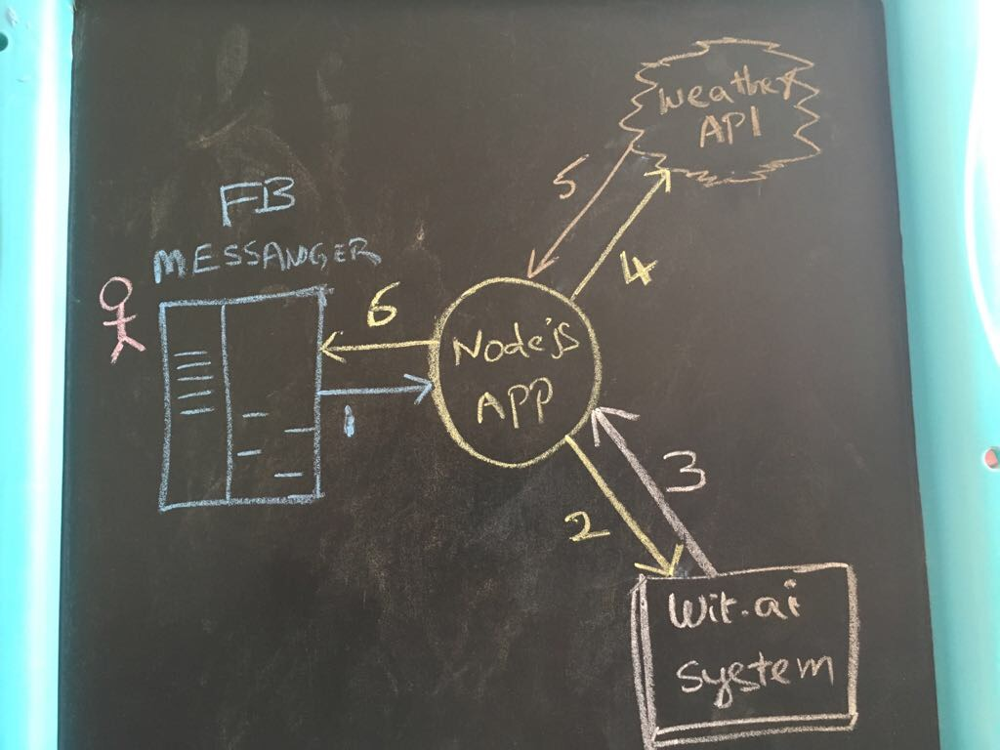
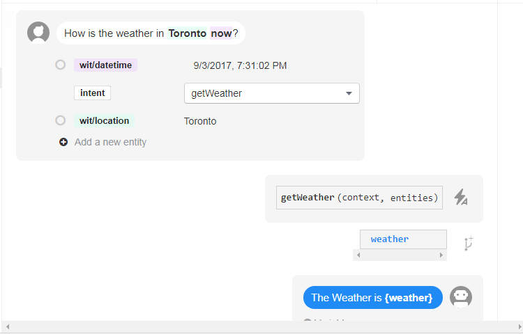

# FaceBook Weather chatbot

This chatbot uses Facebook Messenger API + Wit.ai + Open Weather Map.

## Architecture



## Build

```
yarn install
npm run build
```

## Wit.ai story



## Execute

```
NODE_ENV=production \
PORT=3000 \
FB_VERIFY_TOKEN=<VERIFY TOKEN> \
FB_PAGE_ACCESS_TOKEN=<PAGE ACCESS TOKEN> \
WIT_TOKEN=<WIT API TOKEN> \
OPEN_WEATHER_API_KEY=<OPEN WEATHER MAP API KEY> \
node dist/index.js
```

## References

* [Messenger Quick Start](https://developers.facebook.com/docs/messenger-platform/guides/quick-start)
* [Wit.ai Quick Start](https://wit.ai/docs/quickstart)
* [Open Weather Map API](https://openweathermap.org/api)